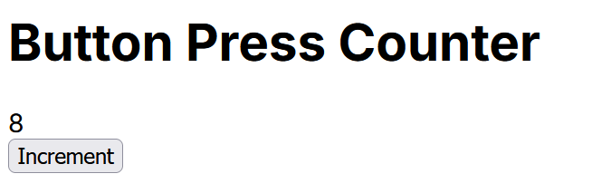

## Notes on learning experience:

v0 was able to quickly create the app. However, I had to specify that I wanted a version that would run in a git repository (meaning that it included the required dependencies). There was some tedium due to being forced to download each file individually, create the directories myself, and rename the files to the proper names since v0 cannot provide a complete zip file. Finally, there was an error due to v0 not telling me to install a certain dependecy which was quickly resolved after telling it the error message.

## Screenshot of app:

