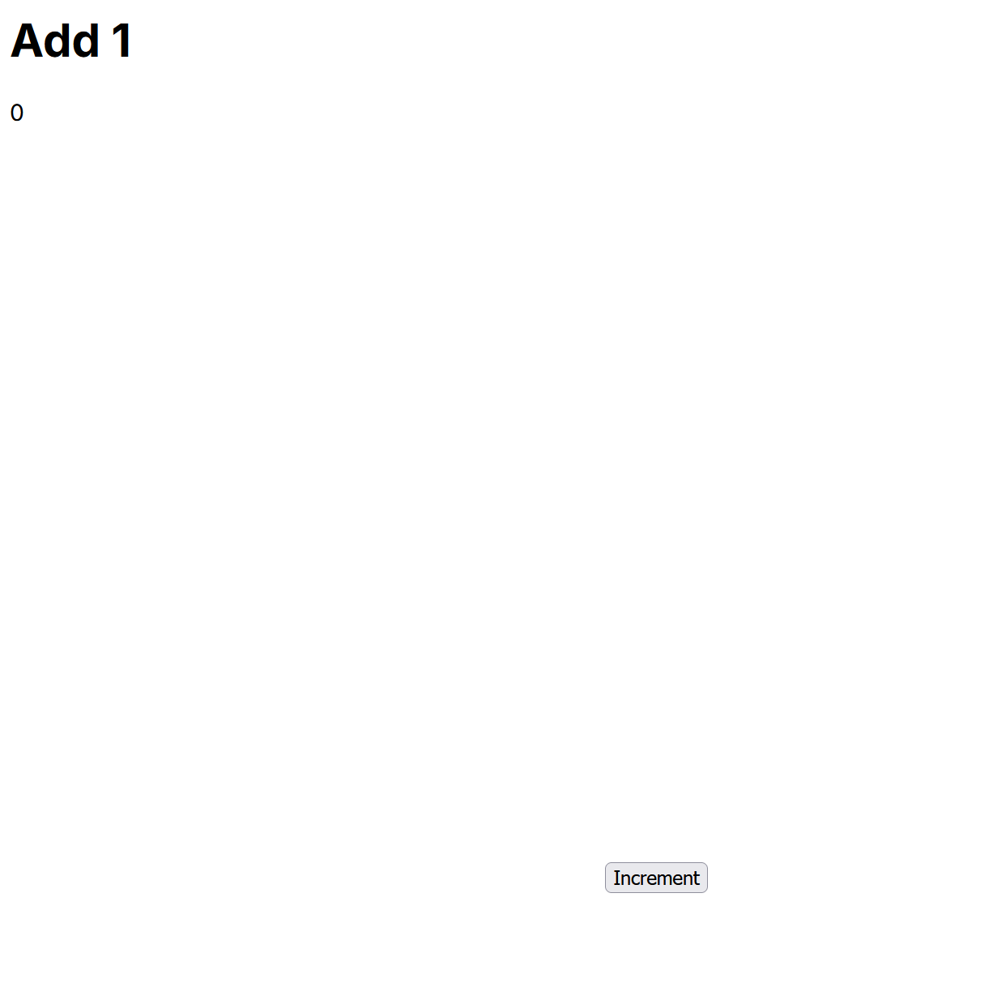

## Notes on learning experience:

3rd week:
v0 was able to quickly create the app. However, I had to specify that I wanted a version that would run in a git repository (meaning that it included the required dependencies). There was some tedium due to being forced to download each file individually, create the directories myself, and rename the files to the proper names since v0 cannot provide a complete zip file. Finally, there was an error due to v0 not telling me to install a certain dependecy which was quickly resolved after telling it the error message.

5th week:
This time I used Aider to modify my old button app by making the button teleport away whenever you click on it. I also used Aider for other minor changes like changing the text displayed. It was relatively to set up and use Aider, and it seemed to be more useful to my needs than v0 because it made more minimialistic and human-readable changes and told me exactly what it had done. It also let me easily undo the changes if they had problems. It was not able to do changes if they were too complex, such as moving the button simply by mousing over it without clicking.

## Screenshot of app:

